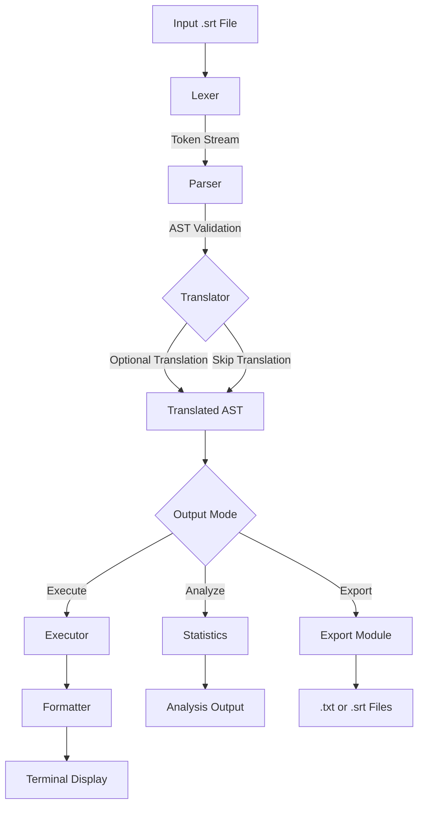
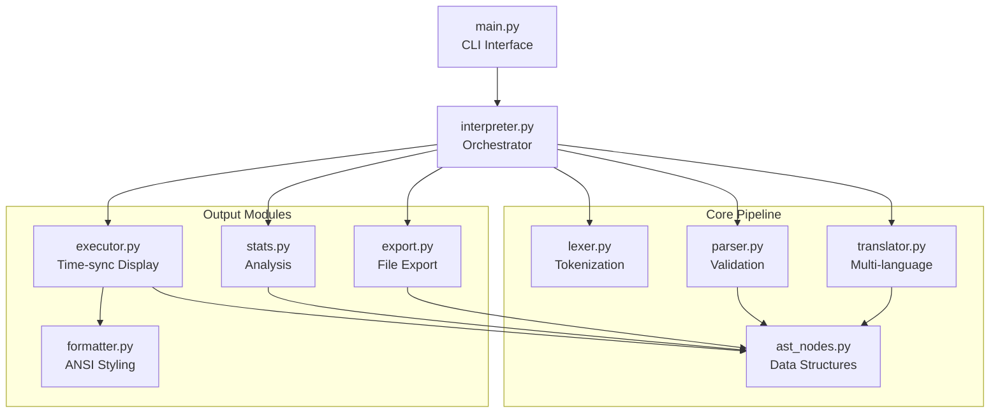

# SRT Subtitle Interpreter

A Python-based interpreter for SubRip Text (.srt) subtitle files that can parse, validate, translate, and execute time-synchronized subtitle display commands.

## Features

- Parse and tokenize .srt subtitle files with comprehensive validation
- Validate subtitle format, timing constraints, and sequential ordering
- Multi-language translation support (Filipino, Korean, Chinese, Japanese, English)
- File-based caching system for efficient translation performance
- Statistics calculation (duration, entry counts, text length analysis)
- Export functionality (plain text, numbered text, separated text, translated SRT)
- ANSI formatting for terminal display (italic, bold, underline, colors)
- Multiple execution modes (sequential, real-time, accelerated playback)

## Architecture

### Execution Pipeline

The interpreter follows a multi-stage pipeline architecture:



### Module Architecture

Component relationships and dependencies:



## Installation

### Prerequisites

- Python 3.13 or higher

### Installing uv on Windows

1. Open PowerShell and run the installation command:

```powershell
powershell -ExecutionPolicy ByPass -c "irm https://astral.sh/uv/install.ps1 | iex"
```

2. Verify installation by checking the version:

```powershell
uv --version
```

3. If the command is not recognized, add uv to your PATH:
   - The installer typically adds uv to `%USERPROFILE%\.cargo\bin`
   - Restart your terminal or PowerShell window
   - Try `uv --version` again

### Project Setup

1. Clone or navigate to the project directory:

```bash
cd CSS125L_machine_project
```

2. Sync dependencies using uv:

```bash
uv sync
```

This command reads `pyproject.toml` and installs all required dependencies including:
- `deep-translator` for multi-language translation
- Python 3.13+ runtime environment

3. Activate the virtual environment:

**Windows (PowerShell):**
```powershell
.venv\Scripts\activate
```

**Windows (Command Prompt):**
```cmd
.venv\Scripts\activate.bat
```

**Linux/MacOS:**
```bash
source .venv/bin/activate
```

4. Verify installation:

```bash
python --version
python main.py --help
```

You should see Python 3.13+ and the interpreter's help message.

## Quick Start

Basic execution with default settings (Filipino translation, sequential mode):

```bash
python main.py examples/valid_basic.srt
```

Translate to Korean with ANSI formatting:

```bash
python main.py examples/valid_basic.srt --lang korean --format
```

Display statistics about a subtitle file:

```bash
python main.py examples/valid_complex.srt --stats
```

## Usage

### Basic Syntax

```bash
python main.py <filepath> [options]
```

### Options

| Option | Values | Default | Description |
|--------|--------|---------|-------------|
| `--mode` | sequential, real_time, accelerated | sequential | Execution mode for subtitle display |
| `--speed` | float (e.g., 5.0, 10.0) | 5.0 | Speed multiplier for accelerated mode |
| `--lang` | english, filipino, korean, chinese, japanese | filipino | Target language for translation |
| `--stats` | flag | disabled | Display file statistics instead of executing |
| `--export-txt` | path | output.txt | Export subtitle text to file |
| `--export-srt` | path | output_{lang}.srt | Export translated SRT file |
| `--export-format` | plain, numbered, separated | plain | Text export format style |
| `--format` | flag | disabled | Enable ANSI formatting for HTML tags |

### Example Commands

Accelerated playback at 10x speed with Japanese translation:

```bash
python main.py examples/valid_basic.srt --mode accelerated --speed 10.0 --lang japanese
```

Export translated Chinese subtitles to SRT file:

```bash
python main.py examples/valid_basic.srt --lang chinese --export-srt output_chinese.srt
```

Export numbered text format with statistics:

```bash
python main.py examples/valid_complex.srt --export-txt output.txt --export-format numbered --stats
```

Real-time playback with ANSI formatting:

```bash
python main.py examples/valid_basic.srt --mode real_time --format
```

## Project Structure

```
CSS125L_machine_project/
├── src/                 # Source code modules
│   ├── lexer.py        # Tokenization of .srt files
│   ├── parser.py       # Parsing and validation
│   ├── ast_nodes.py    # Abstract syntax tree nodes
│   ├── translator.py   # Multi-language translation
│   ├── executor.py     # Time-synchronized execution
│   ├── interpreter.py  # Main interpreter interface
│   ├── stats.py        # Statistics calculation
│   ├── export.py       # Text and SRT export
│   └── formatter.py    # ANSI formatting for HTML tags
├── tests/              # Comprehensive test suite
├── examples/           # Sample .srt subtitle files
├── main.py            # Command-line interface
├── demo.ipynb         # Jupyter notebook documentation
└── pyproject.toml     # Project dependencies and metadata
```

## License

This project is part of the CSS125L Machine Project coursework.
